# DQBB

Dragon Quest Battle Builder (DQBB) is a turn-based battle simulator inspired by the classic Dragon Quest game. It allows users to create custom teams with configurable characters, enabling them to strategize and pit their teams against one another in simulated battles.

# Overview
The battle simulator allows for the creation of characters with detailed configurations, including attributes, abilities, and decision-making logic. These characters can be assembled into teams to battle each other, with each battle playing out based on the characters' configurations and the strategies they employ.

# Character Configuration
Characters in the simulator are defined using a JSON configuration. Each character has various attributes such as agility, damage resistance, hit points, and more. Below is an example configuration for a WRAITH KNIGHT:

```json
{
    "agility": 56,
    "damageResistance": 52,
    "decisions": [ ... ],
    "experiencePoints": 28,
    "goldPoints": 120,
    "hitPointsMaximum": 46,
    "id": "17",
    "magicPointsMaximum": 20,
    "name": "WRAITH_KNIGHT",
    "pattern": "176",
    "statusResistance": 80,
    "strength": 68
}
```

# Abilities and Decisions
Characters can perform various abilities during battle, such as healing or attacking. These abilities are defined in the decisions array within the character's configuration. Each decision specifies an ability, preconditions for that ability, and target selection criteria.

## Example Decision
The WRAITH KNIGHT has two decisions defined: one for healing and one for attacking.

### Healing

```json 
{
    "ability": {
        "actionType": "HEAL",
        "conditionType": "HIT_POINTS",
        "orderType": "MIN"
    },
    "preCondition": {
        "matchType": "ALL",
        "qualifiers": [ ... ]
    },
    "priorityType": "HIGHEST",
    "targetSelection": {
        "matchType": "ANY",
        "qualifiers": [ ... ]
    }
}

```

### Attacking
```json
{
    "ability": {
        "actionType": "ATTACK",
        "conditionType": "HIT_POINTS",
        "orderType": "MAX"
    },
    "preCondition": {
        "matchType": "ANY",
        "qualifiers": [ ... ]
    },
    "priorityType": "LOWEST",
    "targetSelection": {
        "matchType": "ANY",
        "qualifiers": [ ... ]
    }
}

```

# Conditions and Targeting
Conditions and targeting rules dictate when and how abilities are used. These rules can be based on various attributes of the characters involved in the battle.

```json
{
    "agility": 56,
    "damageResistance": 52,
    "decisions": [
        {
            "ability": {
                "actionType": "HEAL",
                "conditionType": "HIT_POINTS",
                "orderType": "MIN"
            },
            "preCondition": {
                "matchType": "ALL",
                "qualifiers": [
                    {
                        "actorCheckers": [
                            {
                                "conditionType": "HIT_POINTS",
                                "expressionType": "PERCENTAGE",
                                "operatorType": "LESS_THAN",
                                "priorityType": "HIGHEST",
                                "value": 26
                            }
                        ],
                        "matchType": "ANY",
                        "priorityType": "HIGHEST",
                        "targetType": "ALLY"
                    },
                    {
                        "actorCheckers": [
                            {
                                "conditionType": "MAGIC_POINTS",
                                "expressionType": "EXACT",
                                "operatorType": "GREATER_THAN",
                                "priorityType": "HIGHEST",
                                "value": 1
                            }
                        ],
                        "matchType": "ANY",
                        "priorityType": "HIGHEST",
                        "targetType": "SELF"
                    }
                ]
            },
            "priorityType": "HIGHEST",
            "targetSelection": {
                "matchType": "ANY",
                "qualifiers": [
                    {
                        "actorCheckers": [
                            {
                                "conditionType": "HIT_POINTS",
                                "expressionType": "PERCENTAGE",
                                "operatorType": "LESS_THAN",
                                "priorityType": "HIGHEST",
                                "value": 26
                            }
                        ],
                        "matchType": "ANY",
                        "priorityType": "HIGHEST",
                        "targetType": "ALLY"
                    }
                ]
            }
        },
        {
            "ability": {
                "actionType": "ATTACK",
                "conditionType": "HIT_POINTS",
                "orderType": "MAX"
            },
            "preCondition": {
                "matchType": "ANY",
                "qualifiers": [
                    {
                        "actorCheckers": [
                            {
                                "conditionType": "HIT_POINTS",
                                "expressionType": "EXACT",
                                "operatorType": "GREATER_THAN",
                                "priorityType": "HIGHEST",
                                "value": 0
                            }
                        ],
                        "matchType": "ANY",
                        "priorityType": "HIGHEST",
                        "targetType": "ENEMY"
                    }
                ]
            },
            "priorityType": "LOWEST",
            "targetSelection": {
                "matchType": "ANY",
                "qualifiers": [
                    {
                        "actorCheckers": [
                            {
                                "conditionType": "HIT_POINTS",
                                "expressionType": "EXACT",
                                "operatorType": "GREATER_THAN",
                                "priorityType": "HIGHEST",
                                "value": 0
                            }
                        ],
                        "matchType": "ANY",
                        "priorityType": "HIGHEST",
                        "targetType": "ENEMY"
                    }
                ]
            }
        }
    ],
    "experiencePoints": 28,
    "goldPoints": 120,
    "hitPointsMaximum": 46,
    "id": "17",
    "magicPointsMaximum": 20,
    "name": "WRAITH_KNIGHT",
    "pattern": "176",
    "statusResistance": 80,
    "strength": 68
}
```

### Condition Types

The following enum defines the possible condition types that can be checked for a character's state:

- AGILITY
- HERBS
- HIT_POINTS
- HIT_POINTS_MAXIMUM
- MAGIC_POINTS
- MAGIC_POINTS_MAXIMUM
- MAGIC_POTIONS
- STATUS_RESISTANCE
- TURNS_SLEEP
- TURNS_STOP_SPELL

# Actors

|SPRITE|NAME|
|-|-|
|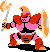|[ARMORED_KNIGHT](./src/main/resources/actors/ARMORED_KNIGHT.json)|
|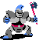|[AXE_KNIGHT](./src/main/resources/actors/AXE_KNIGHT.json)|
|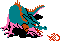|[BLUE_DRAGON](./src/main/resources/actors/BLUE_DRAGON.json)|
|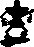|[DEMON_KNIGHT](./src/main/resources/actors/DEMON_KNIGHT.json)|
|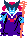|[DRAGONLORD_1](./src/main/resources/actors/DRAGONLORD_1.json)|
|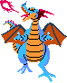|[DRAGONLORD_2](./src/main/resources/actors/DRAGONLORD_2.json)|
|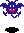|[DRAKEE](./src/main/resources/actors/DRAKEE.json)|
|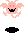|[DRAKEEMA](./src/main/resources/actors/DRAKEEMA.json)|
|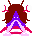|[DROLL](./src/main/resources/actors/DROLL.json)|
||[DROLLMAGI](./src/main/resources/actors/DROLLMAGI.json)|
|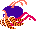|[DRUIN](./src/main/resources/actors/DRUIN.json)|
||[DRUINLORD](./src/main/resources/actors/DRUINLORD.json)|
||[GHOST](./src/main/resources/actors/GHOST.json)|
|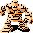|[GOLDMAN](./src/main/resources/actors/GOLDMAN.json)|
|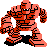|[GOLEM](./src/main/resources/actors/GOLEM.json)|
|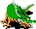|[GREEN_DRAGON](./src/main/resources/actors/GREEN_DRAGON.json)|
|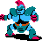|[KNIGHT](./src/main/resources/actors/KNIGHT.json)|
|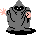|[MAGICIAN](./src/main/resources/actors/MAGICIAN.json)|
|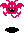|[MAGIDRAKEE](./src/main/resources/actors/MAGIDRAKEE.json)|
|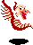|[MAGIWYVERN](./src/main/resources/actors/MAGIWYVERN.json)|
|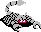|[METAL_SCORPION](./src/main/resources/actors/METAL_SCORPION.json)|
||[METAL_SLIME](./src/main/resources/actors/METAL_SLIME.json)|
||[POLTERGEIST](./src/main/resources/actors/POLTERGEIST.json)|
|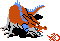|[RED_DRAGON](./src/main/resources/actors/RED_DRAGON.json)|
||[RED_SLIME](./src/main/resources/actors/RED_SLIME.json)|
|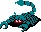|[ROGUE_SCORPION](./src/main/resources/actors/ROGUE_SCORPION.json)|
|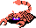|[SCORPION](./src/main/resources/actors/SCORPION.json)|
|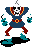|[SKELETON](./src/main/resources/actors/SKELETON.json)|
||[SLIME](./src/main/resources/actors/SLIME.json)|
||[SPECTER](./src/main/resources/actors/SPECTER.json)|
||[STARWYVERN](./src/main/resources/actors/STARWYVERN.json)|
|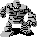|[STONE_MAN](./src/main/resources/actors/STONE_MAN.json)|
|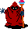|[WARLOCK](./src/main/resources/actors/WARLOCK.json)|
|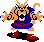|[WEREWOLF](./src/main/resources/actors/WEREWOLF.json)|
|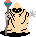|[WIZARD](./src/main/resources/actors/WIZARD.json)|
|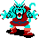|[WOLF](./src/main/resources/actors/WOLF.json)|
|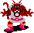|[WOLFLORD](./src/main/resources/actors/WOLFLORD.json)|
|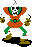|[WRAITH](./src/main/resources/actors/WRAITH.json)|
|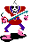|[WRAITH_KNIGHT](./src/main/resources/actors/WRAITH_KNIGHT.json)|
|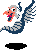|[WYVERN](./src/main/resources/actors/WYVERN.json)|
